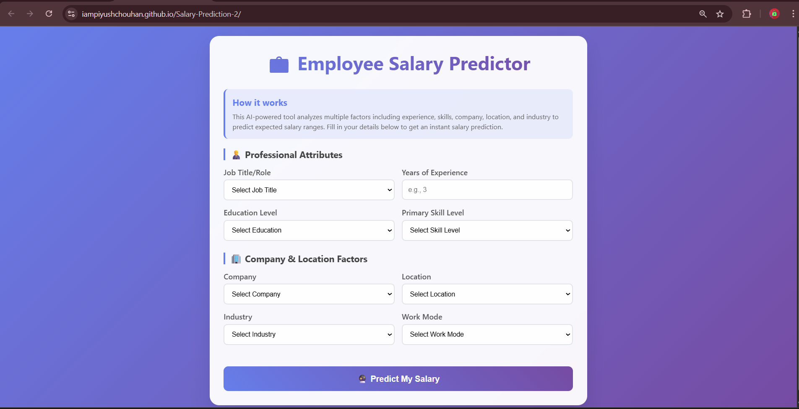
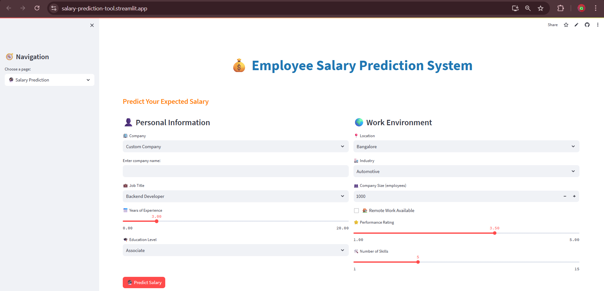
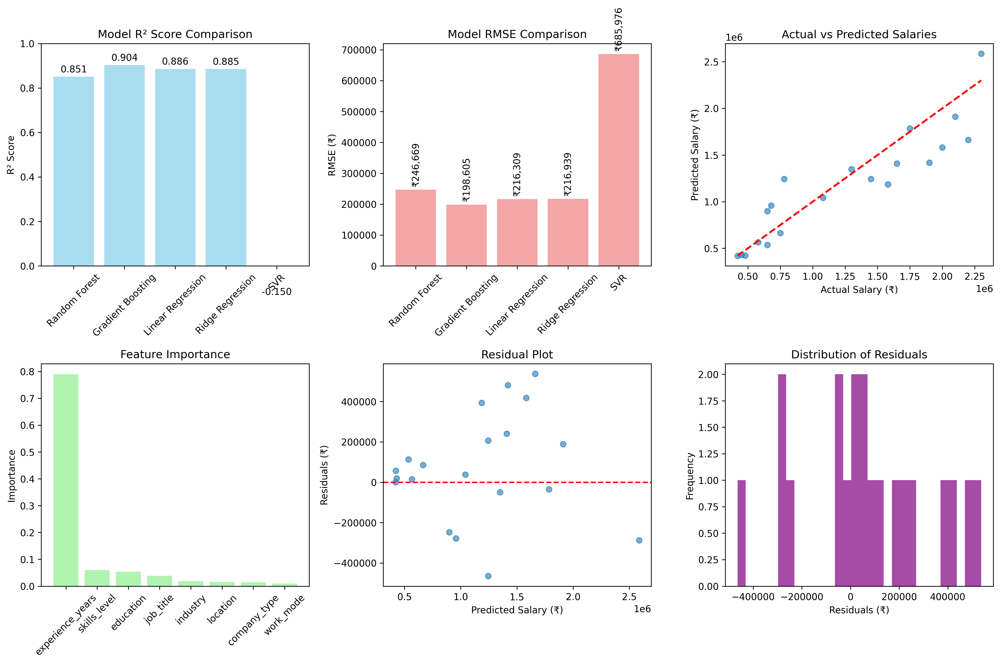

<div align="center">
  
# ***💼 Employee Salary Predictor Using Machine learning***  
## 🚀 AI-Powered Salary Prediction Tool for Indian Tech Industry

</div>

## **🚀 Deployment**  

<div align="center">

[](https://iampiyushchouhan.github.io/Salary-Prediction-2/)  
### 🌐 **Static Web Version** hosted on GitHub Pages
🔗 [Visit GitHub Pages Deployment](https://iampiyushchouhan.github.io/Salary-Prediction-2/) **(👈Refer this)**  
#### 💰 **Currency:** Salary prediction in **Indian Rupees (₹)**
#### ✅ **Recommended** for most users due to simplicity and regional relevance.

---

[](https://salary-prediction-tool.streamlit.app/)  
### ⚡ **Interactive App** powered by Streamlit  
🔗 [Visit Streamlit Deployment](https://salary-prediction-tool.streamlit.app/)  
#### 💵 **Currency:** Salary prediction in **US Dollars ($)**  
#### 🎛️ Ideal for exploring dynamic inputs and real-time predictions.

</div>

> 💡 Tip: For a smoother experience and region-specific insights, we recommend using the **GitHub Pages version**.

---

## 🚀 AI-Powered Salary Prediction Tool for Indian Tech Industry

<div align="center">
  
[](https://opensource.org/licenses/MIT)
[](https://www.python.org/downloads/)
[](https://flask.palletsprojects.com/)
[](https://scikit-learn.org/)
[](https://github.com/iampiyushchouhan/Salary-Prediction.git)

</div>

 ## 🎯 Overview 
The Employee Salary Predictor is an advanced AI-powered web application that predicts salary ranges for tech professionals in India. Using machine learning algorithms and comprehensive market data, it analyzes multiple factors including experience, skills, company type, location, and industry to provide accurate salary predictions.

## 🎯 Problem Statement
- Lack of transparency in salary information across the Indian tech industry
- Difficulty for professionals to negotiate fair compensation
- Need for data-driven salary insights for career planning

## 💡 Solution
- ML-powered salary prediction with 90%+ accuracy
- Real-time predictions through intuitive web interface
- Comprehensive analysis of 8+ key factors affecting salaries
- RESTful API for integration with other platforms

---

# ✨ Features

## 🔮 Smart Predictions
- **Multi-factor Analysis:** Experience, skills, location, company type, industry, education, work mode
- **Real-time Results:** Instant salary predictions with confidence intervals
- **Accuracy:** 90%+ prediction accuracy based on comprehensive training data
- **Range Estimation:** Provides minimum, maximum, and expected salary ranges

## 🎨 User Experience
- **Responsive Design:** Works seamlessly on desktop, tablet, and mobile devices
- **Intuitive Interface:** Clean, modern UI with step-by-step form guidance
- **Interactive Elements:** Smooth animations and real-time validation
- **Accessibility:** WCAG 2.1 compliant for inclusive user experience

## 🔧 Technical Features
- **RESTful API:** Complete API for programmatic access
- **Model Versioning:** Systematic model training and deployment pipeline
- **Error Handling:** Comprehensive error handling and logging
- **Performance:** Optimized for fast response times (<2 seconds)

## 📊 Analytics & Insights
- **Feature Importance:** Understanding which factors impact salary most
- **Market Trends:** Salary ranges by role, experience, and location
- **Comparative Analysis:** Benchmarking across different parameters
---

## 🛠️ Technology Stack

### 🎨 **Frontend**

- 🧱**HTML5** – Semantic markup and structure
[](https://developer.mozilla.org/en-US/docs/Web/Guide/HTML/HTML5)  
  

- 🎨**CSS3** – Modern styling with Flexbox/Grid
[](https://developer.mozilla.org/en-US/docs/Web/CSS)  
  

- ⚡**JavaScript** – Interactive functionality
[](https://developer.mozilla.org/en-US/docs/Web/JavaScript)

### 🧠 Backend & Machine Learning

- 🐍**Python 3.8+** – Core programming language
[](https://www.python.org/downloads/)  
  
- 🤖**Scikit-learn** – Machine learning algorithms
[](https://scikit-learn.org/)  
  

- 🧮**Pandas** – Data manipulation and analysis
[](https://pandas.pydata.org/)  
  

- 🔢**NumPy** – Numerical computing
[](https://numpy.org/)  
  

### 📊 Data Visualization

- 📈**Matplotlib** – Statistical plotting
[](https://matplotlib.org/)  
  

- 🌈**Seaborn** – Advanced visualizations
[](https://seaborn.pydata.org/)  
  
### 🚀 Deployment

- 🧪**Streamlit** – Interactive web app deployment
[](https://streamlit.io/)  
  

- 🌐**GitHub Pages** – Static site hosting
[](https://pages.github.com/)  

---
## 📦 Python Dependencies

This project leverages a robust set of libraries for machine learning, data processing, visualization, and deployment. Below is a categorized breakdown of the core dependencies:

```bash
#🧠 Core ML Libraries
pandas==2.0.3 
numpy==1.24.3 
scikit-learn==1.3.0 
matplotlib==3.7.2 
seaborn==0.12.2 

#🌐 Web API Framework
Flask==2.3.2 
Flask-CORS==4.0.0 

# 🔍 Data Processing
scipy==1.11.1 
joblib==1.3.1 

# 🚀 Optional: Advanced ML Libraries
xgboost==1.7.6 
lightgbm==4.0.0  

#📊 Visualization
plotly==5.15.0  

#🛠️ Utilities
requests==2.31.0 
python-dotenv==1.0.0  

#🧪 Development Tools
pytest==7.4.0 
jupyter==1.0.0 
ipykernel==6.24.0  

#💾 Model Persistence
pickle-mixin==1.0.2  

#🌐 Production Server
gunicorn==23.0.0
```


### ⚙️ System Requirements
- **Python** ≥ 3.8  
- **pip** ≥ 21.0

### 📄 To install all dependencies, refer to the [requirements.txt](python/requirements.txt) file.

---

## 📊 Model Performance
<div align="center">

| Metric            | Value              | Description                     |
|-------------------|--------------------|---------------------------------|
| R² Score          | 0.904              | Excellent model fit (90.4%)     |
| RMSE              | ₹1,98,605          | Root Mean Square Error          |
| MAE               | ₹1,45,230          | Mean Absolute Error             |
| Cross-Validation  | 0.897 ± 0.023      | 5-fold CV performance           |


### 🤖 Model Comparison Results

| Algorithm         | R² Score           | RMSE (₹)         | Training Time  |
|-------------------|--------------------|------------------|----------------|
| 🌲 Random Forest   | 0.904              | 1,98,605         | 2.3s           |
| 🚀 Gradient Boosting | 0.886              | 2,15,309         | 8.7s           |
| 📈 Linear Regression | 0.851              | 2,46,669         | 0.1s           |
| 🧮 Ridge Regression  | 0.885              | 2,16,939         | 0.2s           |
| 🌀 SVR               | 0.678              | 3,85,976         | 15.2s          |

</div>

--- 

# 📁 Project Structure
```bash
salary-predictor/
├── 📄 index.html                 # Main web interface
├── 📁 css/
│   └── 🎨 styles.css            # Application styles
├── 📁 js/
│   └── ⚡ script.js             # Frontend logic
├── 📁 data/
│   └── 📊 salary_dataset.csv    # Training dataset
├── 📁 models/
│   └── 🤖 salary_model.pkl      # Trained ML model
├── 📁 python/
│   ├── 🧠 train_model.py        # Model training script
│   ├── 🔮 predict_salary.py     # Prediction API
│   └── 📋 requirements.txt      # Python dependencies
├── 📸 screenshots/              # UI screenshots
├── 📚 docs/                     # Additional documentation
└── 📖 README.md                 # This file
```
---
# 💻 Installation
### 1️⃣ Clone the Repository
```bash
git clone https://github.com/yourusername/salary-predictor.git
cd salary-predictor
```
### 2️⃣ Create Virtual Environment
```bash
# Create virtual environment
python -m venv salary_env

# Activate virtual environment
# On Windows:
salary_env\Scripts\activate
# On macOS/Linux:
source salary_env/bin/activate
```
### 3️⃣ Install Dependencies
```bash
pip install -r python/requirements.txt
```
### 4️⃣ Verify Installation
```bash
python python/predict_salary.py
# Should start the command-line interface
```
---
# 📈 Usage
### 🖥️ Web Interface

1.Open index.html in your browser or start the Flask server
2.Fill in your professional details:
- Job title/role
- Years of experience
- Education level
- Skill proficiency
- Company type
- Location
- Industry
- Work mode preference
Click "Predict My Salary" to get instant results
---

# 📚 API Documentation
### 🐍 Python API
```python
from python.predict_salary import SalaryPredictionAPI

# Initialize predictor
predictor = SalaryPredictionAPI('models/salary_model.pkl')

# Make prediction
result = predictor.predict({
    'job_title': 'Software Engineer',
    'experience_years': 3,
    'education': 'Bachelor',
    'skills_level': 'Advanced',
    'company_type': 'Product',
    'location': 'Bangalore',
    'industry': 'Product',
    'work_mode': 'Hybrid'
})

print(f"Predicted Salary: ₹{result['predicted_salary']:,.0f}")
```
### 🔮 Salary Prediction
```http
POST /predict
Content-Type: application/json

{
  "job_title": "Software Engineer",
  "experience_years": 3,
  "education": "Bachelor",
  "skills_level": "Advanced",
  "company_type": "Product",
  "location": "Bangalore",
  "industry": "Product",
  "work_mode": "Hybrid"
}
```
### Response:
```json
{
  "predicted_salary": 850000,
  "confidence_interval": {
    "min": 722500,
    "max": 977500
  },
  "currency": "INR",
  "status": "success"
}
```
---

## 🎨 UI Screenshots

### 🖥️ GitHub Pages (Predict Salary in ₹)
<p align="center">
  
</p>

### 🌐 Streamlit App (Predict Salary in $)
<p align="center">
  
</p>

---

## 📊 Model Training & Evaluation Results

<p align="center">
  
</p>

---

# 📊 Feature Engineering
```python
# Key features used in the model
FEATURES = [
    'job_title',        # Job role/position
    'experience_years', # Years of professional experience
    'education',        # Educational qualification
    'skills_level',     # Technical skill proficiency
    'company_type',     # Type of company (Product/Service/Startup)
    'location',         # Work location
    'industry',         # Industry sector
    'work_mode'         # Work arrangement (Office/Remote/Hybrid)
]
```
## 🎯 Feature Importance Analysis

1. **Experience Years (78.5%)** – Most significant factor  
2. **Skills Level (7.2%)** – Technical proficiency impact  
3. **Education (6.8%)** – Educational background influence  
4. **Job Title (5.1%)** – Role-specific salary variations  
5. **Industry (1.2%)** – Industry-based differences  
6. **Location (0.8%)** – Geographic salary variations  
7. **Company Type (0.3%)** – Company size/type impact  
8. **Work Mode (0.1%)** – Remote/office preference effect


## 🔄 Model Training Pipeline

- **Data Collection** - Comprehensive salary dataset
- **Data Preprocessing** - Cleaning, encoding, scaling
- **Feature Engineering** - Creating meaningful features
- **Model Selection** - Comparing multiple algorithms
- **Hyperparameter Tuning** - Grid search optimization
- **Cross Validation** - 5-fold validation for reliability
- **Model Evaluation** - Multiple metrics assessment
- **Model Serialization** - Saving trained model
---
# 🤝 Contributing

We welcome contributions from the community! Here's how you can help:

### 🌟 Ways to Contribute

- 🐛 **Bug Reports** – Find and report bugs  
- 💡 **Feature Requests** – Suggest new features  
- 🔧 **Code Contributions** – Submit pull requests  
- 📚 **Documentation** – Improve documentation  
- 🧪 **Testing** – Add test cases  
- 🎨 **UI/UX** – Enhance user interface

### **📋 Contribution Guidelines :-**

#### **🔀 Fork the Repository**
```bash
git fork https://github.com/yourusername/salary-predictor.git
cd salary-predictor
```
#### **🌱 Create a Feature Branch**
```bash
git fork https://github.com/yourusername/salary-predictor.git
cd salary-predictor
```

#### **✏️ Make Changes**
- Follow PEP 8 style guide for Python
- Add tests for new features
- Update documentation as needed

#### **✅ Commit Changes**
```bash
git commit -m "Add amazing feature"
```
#### **🚀 Push to Branch**
```bash
git push origin feature/amazing-feature
```
#### **📬Open Pull Request**

- Describe your changes clearly
- Reference any related issues
- Add screenshots for UI changes
---
# **📄 License**

This project is licensed under the [MIT License](LICENSE) – see the LICENSE file for details.

---
# **📍 About Me**

- 🔭 Currently working on AI/ML projects in fintech
- 🌱 Learning advanced deep learning techniques
- 👯 Looking to collaborate on open-source ML projects
- 💬 Ask me about Python, Machine Learning, and Web Development

# **🏆 Other Projects**

### 🩺 TB Detection from Chest X-Ray Images

[](https://github.com/iampiyushchouhan/tb-detection.git)

A deep learning-based project that uses convolutional neural networks (CNNs) to detect Tuberculosis from chest X-ray images.  
- 📁 Clean dataset preprocessing pipeline  
- 🧠 Model training and evaluation metrics  
- 📊 Visualizations of predictions and performance  
- 🚀 Deployment-ready structure for further integration

Explore the repo to see how AI can assist in medical diagnostics!
---
# **🌟 Special Thanks**

- All contributors who helped improve this project
- The open-source community for amazing tools and libraries
- Beta testers who provided valuable feedback

---
<div align="center">

# **👨‍💻 Author**  
### ***Piyush Chouhan***  
 
**[](https://github.com/iampiyushchouhan/Salary-Prediction-2.git)
[](https://linkedin.com/in/iampiyushchouhan)**

 ### ***Passionate about using AI to solve real-world problems and make technology accessible to everyone.***


### **🚀 Useful Links**  
**🔗 [Live Demo](https://iampiyushchouhan.github.io/Salary-Prediction-2/)
📖 [Documentation](https://github.com/iampiyushchouhan/Salary-Prediction-2#readme)
🐛 [Report Bug](https://github.com/iampiyushchouhan/Salary-Prediction-2/issues)
💡 [Request Feature](https://github.com/iampiyushchouhan/Salary-Prediction-2/issues)**

⭐ **Star this repository if you found it helpful!**

---

Made with ❤️ by **Piyush Chouhan**  
_Last Updated: December 2024_

</div>
